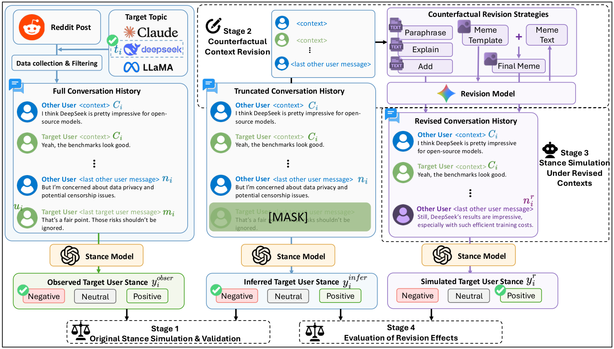

# Revising Context, Shifting Simulated Stance: Auditing LLM-Based Stance Simulation in Online Discussions

[Xinnong Zhang](https://lishi905.github.io/)<sup>1,4</sup>\*, Wanting Shan<sup>2</sup>\*, [Hanjia Lyu](https://brucelyu17.github.io/)<sup>3</sup>†, [Zhongyu Wei](http://www.fudan-disc.com/people/zywei)<sup>1,4</sup>, [Jiebo Luo](https://www.cs.rochester.edu/u/jluo/)<sup>2</sup>

<sup>1</sup> Fudan University, 
<sup>2</sup> University of Rochester,
<sup>3</sup> Singapore Management University,
<sup>4</sup> Shanghai Innovation Institute

*: equal contribution

†: project lead

Accepted for publication in the Findings of [EMNLP 2026](https://2026.emnlp.org/)

## Overview

We study counterfactual context revision as a framework for auditing LLM-based stance simulation in online discussions. Each instance is a Reddit conversation about DeepSeek, Claude or Llama. In Stage 1, a stance simulator labels the target user's observed stance from the full thread and infers the stance with the user's last message masked. In Stage 2, a revision model rewrites the last message from another user with a text-only strategy (*paraphrase*, *explain*, *add*) or a multimodal *meme* strategy. Four ablations (*r_white_meme*, *r_humor*, *r_caption_cut*, *r_caption*) isolate the role of the meme template in revision and in stance inference. In Stage 3, the simulator infers the stance again under the revised context. Stage 4 compares the strategies by the average directional stance shift and the stance transition rate. The results show effective and robust stance transitions under both text-only and multimodal strategies.



## Repository layout

```
StanceShift/
├── data/
│   ├── skeletons/{topic}.jsonl          conversation structure without texts (787 / 538 / 496)
│   ├── conversations/{topic}.jsonl      full conversations, created by pipeline/rehydrate.py
│   ├── ablation_ids/{topic}.txt         50 conversation ids per topic for the meme ablations
│   └── template_ids/{topic}.json        meme template per conversation (additional domains)
├── meme_templates/                      the 5 meme templates and their captions
├── assets/                              README figure
├── pipeline/
│   ├── rehydrate.py                     fetches the conversation texts from Reddit
│   ├── preprocess.py                    raw Reddit comment dump -> conversations
│   ├── prepare_prompt.py                revision requests and stance prompts
│   ├── revise.py                        revision model (and meme rendering)
│   ├── stance.py                        stance simulator
│   └── llm.py                           API clients
├── outputs/
│   ├── revisions/{topic}_{condition}.jsonl            revised messages and meme texts
│   ├── stances/{simulator}/{topic}_{condition}.csv    raw simulator outputs
│   ├── liwc/{topic}_{original,add,meme}.csv           LIWC-22 word count and Tone
│   └── topics/                                        BERTopic topics and tone distributions
├── analysis/
│   ├── build_tables.py                  outputs/stances -> results/
│   ├── compute_results.py               prints the paper numbers
│   ├── plot_transition_rates.py         -> figures/
│   └── export_tone_tikz.py              prints the coordinates of the tone figures
├── results/{simulator}_{text,meme}.csv  parsed stance labels
└── figures/                             stance transition rate figures
```

`{topic}` is one of `deepseek`, `claude`, `llama`, or one of the additional domains of Appendix G (`nuclear`, `keto`, `ubi`, `spacexipo`). `{simulator}` is one of `gpt-5.2-2025-12-11`, `claude-sonnet-4-6`, `qwen3.5-plus-2026-02-15`.

## Installation

Python 3.10 or later.

```bash
git clone https://github.com/STARResearchLab/StanceShift.git
cd StanceShift
pip install -r requirements.txt
```

All commands are run from the repository root. The analysis scripts need no API key. The pipeline scripts read keys from environment variables:

| Variable | Used for |
|---|---|
| `OPENAI_API_KEY` | stance simulation with `gpt-5.2-2025-12-11`; meme rendering with `gpt-image-2` |
| `GEMINI_API_KEY` | revision with `gemini-3-flash-preview` |
| `OPENAI_COMPATIBLE_BASE_URL`, `OPENAI_COMPATIBLE_API_KEY` | stance simulation with `claude-sonnet-4-6` or `qwen3.5-plus-2026-02-15` through an OpenAI-compatible endpoint that serves these model ids |
| `ANTHROPIC_API_KEY` | revision with `--revision_model claude-haiku-4-5-20251001` |
| `REDDIT_CLIENT_ID`, `REDDIT_CLIENT_SECRET`, `REDDIT_USER_AGENT` | fetching the conversation texts with `pipeline/rehydrate.py` (see [Data](#data)) |

```bash
export OPENAI_API_KEY=...
export GEMINI_API_KEY=...
```

## Data

The conversations come from public Reddit discussions. This repository does not include the Reddit texts. It includes the structure of every conversation, and `pipeline/rehydrate.py` fetches the texts from Reddit with your own API credentials. Please follow Reddit's User Agreement and Data API Terms when using them.

**Conversations.** `data/skeletons/{topic}.jsonl` contains the 1,821 conversations of the paper: 787 about DeepSeek, 538 about Claude and 496 about Llama. Each line is one conversation without its texts (hashes shortened here):

```json
{"conv_id": "deepseek_3", "subreddit": "Conservative", "post_id": "1ic1lyd", "target_user": "<username_a>",
 "conv": {"comment_id": "m9nhxm9", "author": "<username_b>", "text_sha256": "d184967a...",
  "child": {"comment_id": "m9nltjq", "author": "<username_a>", "text_sha256": "6e37124e...",
   "child": {"comment_id": "m9nmrcp", "author": "<username_b>", "text_sha256": "c9ab9dba...",
    "child": {"comment_id": "m9nqg6r", "author": "<username_a>", "text_sha256": "d53a0e74...", "child": null}}}}}
```

`conv` is the comment path from a top-level comment down to the target user's comment. It is stored as a linked list of `{comment_id, author, text_sha256, child}`. The last node is the target user's last message *m<sub>i</sub>*. The last message from another user before it is *n<sub>i</sub>*, which the revision strategies replace. `subreddit`, `post_id` and `comment_id` locate the messages on Reddit, and `target_user` and `author` are Reddit usernames. `text_sha256` is the SHA-256 of the UTF-8 text used in the paper. Deleted accounts have `author: null` in the three main topics and the literal `"[deleted]"` in the four additional domains.

**Fetching the texts.** Register an app of type "script" at [reddit.com/prefs/apps](https://www.reddit.com/prefs/apps), set its credentials and run `pipeline/rehydrate.py`:

```bash
export REDDIT_CLIENT_ID=...
export REDDIT_CLIENT_SECRET=...
export REDDIT_USER_AGENT="stanceshift-rehydrate by u/<your username>"
python pipeline/rehydrate.py                            # all 7 topics
python pipeline/rehydrate.py -t deepseek claude llama   # only these topics
```

The script fetches the 13,599 comments of all topics read-only, 100 per request, and writes `data/conversations/{topic}.jsonl` (the skeleton records with `text` in place of `text_sha256`) and `data/conversations/rehydration_report.json`. Fetched comments are cached in `data/conversations/fetched_comments.jsonl`, so a rerun resumes an interrupted run. Comments edited, deleted or removed since the crawl cannot be recovered: they get the text Reddit shows now, or `[deleted]` if the API no longer returns them. The report compares every text with `text_sha256` and gives per topic the number of messages that are identical to the paper version, changed, deleted or removed, or missing, with the conversations that contain messages of the last three kinds. `--retry_missing` fetches the missing comments again.

The analysis scripts do not need the texts.

**Additional domains.** For Appendix G, `data/skeletons/` also holds 300 conversations for each of four additional stance targets: nuclear energy (`nuclear`), the keto diet (`keto`), universal basic income (`ubi`) and the SpaceX IPO (`spacexipo`). They come with GPT-5.2 outputs for `observed`, `inferred`, `paraphrase`, `explain`, `add` and `meme`. Their meme strategy uses one template per conversation, listed in `data/template_ids/{topic}.json`, and their parsed labels are in `results/gpt-5.2-2025-12-11_domains_{text,meme}.csv`.

**Ablation subset.** `data/ablation_ids/{topic}.txt` lists the 50 conversation ids per topic used for the meme ablations (Table 4).

**Meme templates.** `meme_templates/{0,1,3,4,9}.jpg` are the five templates used in the paper. They were collected from [ImgFlip](https://imgflip.com/memetemplates). Appendix H of the paper shows them as templates 1 to 5 in the order 0, 1, 9, 3, 4. `captions.jsonl` describes each template together with its common usage (used by `caption`), and `captions_visual.jsonl` describes only its visual content (used by `caption_cut`).

**Released outputs.** The revisions, meme texts and simulator outputs are included as generated by the models, and some of them quote parts of the conversations.
- `outputs/revisions/{topic}_{condition}.jsonl`: `{conv_id, revised_message}` for `paraphrase`, `explain`, `add`, `humor`, `caption` and `caption_cut`, and `{conv_id, template_id, meme_text}` for `meme`. `meme_text` is the output of the revision model that assigns text to the positions of the template.
- `outputs/stances/{simulator}/{topic}_{condition}.csv`: columns `conv_id`, `template_id` and `response`. In the released files, `template_id` is present for `meme` and `white_meme` only. `response` holds the raw simulator output. It is usually a JSON object with `stance` and `reasoning`, and failed requests keep the error message. GPT-5.2 covers all conditions, including the ablations on the 50-conversation subsets. Sonnet-4.6 and Qwen3.5-Plus cover `observed`, `inferred`, `paraphrase`, `explain`, `add` and `meme`.
- `caption` and `caption_cut` have five rows per conversation, one per template. Their released revision and stance files do not record the template of each row. Within a conversation, the k-th revision pairs with the k-th stance row. Files newly generated by `revise.py` and `stance.py` carry `template_id` for these conditions.
- `outputs/liwc/{topic}_{original,add,meme}.csv`: LIWC-22 word count (`WC`) and `Tone` of the original *n<sub>i</sub>*, the *add* revision and the meme text. Meme rows also carry `template_id`.
- `outputs/topics/`: BERTopic topic of each conversation (`conv_topics.csv`), topic summary (`topic_info.csv`), topic labels (`topic_labels.txt`) and Tone histograms per topic and strategy (`topic_tone_distribution.csv`).
- `results/{simulator}_text.csv` (`conv_id, topic, observed, inferred, paraphrase, explain, add`) and `results/{simulator}_meme.csv` (`conv_id, topic, template_id, inferred, meme`): stance labels parsed from `outputs/stances`.

## Reproduce the paper results (no API calls)

```bash
python analysis/build_tables.py            # outputs/stances -> results/*.csv
python analysis/compute_results.py         # prints the numbers below
python analysis/plot_transition_rates.py   # writes figures/*.png
python analysis/export_tone_tikz.py        # prints pgfplots coordinates of the tone figures
```

`build_tables.py` rewrites the shipped `results/` files with identical content, so `compute_results.py` and `plot_transition_rates.py` can also be run directly.

| Output | Paper |
|---|---|
| `compute_results.py`: dataset statistics | Section 2.1 (conversations, subreddits, posts, target users, authors) |
| `compute_results.py`: `tab:original_stance_performance` | Table 1 |
| `compute_results.py`: `tab:main-delta` | Table 2 |
| `compute_results.py`: meme neutral -> positive rate | Section 4.2 (17.6%) |
| `compute_results.py`: `tab:meme-ablation` | Table 4 |
| `compute_results.py`: `tab:meme-antipolar` | Table 5 |
| `compute_results.py`: `tab:app-main-delta` | Table 7 (Appendix E.1) |
| `compute_results.py`: `tab:app-domains-tone` | Table 10 (Appendix G) |
| `compute_results.py`: `tab:app-domains-delta` | Table 12 (Appendix G) |
| `figures/transition_rates_gpt-5.2.png` | Figure 3 |
| `figures/transition_rates_three_simulators.png` | Figure 9 (Appendix E.1) |
| `export_tone_tikz.py`: `meme_polarization.tex` | Figure 4 |
| `export_tone_tikz.py`: `meme_polarization_{ai_model_evaluation,software,cost,consciousness}.tex` | Figures 5-8 (Appendix D) |

## Run the full pipeline

Models used in the paper:
- stance simulators: `gpt-5.2-2025-12-11` (main results), `claude-sonnet-4-6` and `qwen3.5-plus-2026-02-15`
- revision model: `gemini-3-flash-preview` (`claude-haiku-4-5-20251001` is also supported for the text strategies through `--revision_model`)
- meme images: `gpt-image-2`

The condition id is the `-s` argument of the pipeline scripts and the name used in output files. `white_meme` is available as GPT-5.2 stance outputs only.

| Paper | Condition id | Revision of *n<sub>i</sub>* | Conversations |
|---|---|---|---|
| observed stance | `observed` | none, *m<sub>i</sub>* kept | all |
| inferred stance | `inferred` | none, *m<sub>i</sub>* masked | all |
| paraphrase | `paraphrase` | paraphrase | all |
| explain | `explain` | explain and address the target user's concerns | all |
| add | `add` | add new arguments | all |
| meme (r_meme) | `meme` | meme text for each of the 5 templates, rendered onto the template | all |
| r_white_meme | `white_meme` | the meme text on a white background | 50 per topic |
| r_humor | `humor` | humorous meme-style reply from a humor instruction | 50 per topic |
| r_caption_cut | `caption_cut` | meme-style reply from a visual caption of each template | 50 per topic |
| r_caption | `caption` | meme-style reply from a caption with usage knowledge of each template | 50 per topic |

The pipeline reads the conversation texts from `data/conversations/{topic}.jsonl`, so fetch them first with `pipeline/rehydrate.py` (see [Data](#data)). The prompts of the conversations listed in the rehydration report can differ from those used in the paper.

Each revision condition runs through `prepare_prompt.py` (builds prompts, no API call), `revise.py` (revision model) and `stance.py` (stance simulator). `observed` and `inferred` skip `revise.py`. The files are:

```
outputs/prompts/revision/{topic}_{condition}.jsonl    revision requests      (prepare_prompt.py)
outputs/revisions/{topic}_{condition}.jsonl           revisions              (revise.py)
outputs/memes/{topic}/{conv_id}_{template_id}.png     rendered memes         (revise.py, meme only)
outputs/prompts/stance/{topic}_{condition}.jsonl      stance prompts         (prepare_prompt.py [--revised])
outputs/stances/{simulator}/{topic}_{condition}.csv   stance outputs         (stance.py)
```

By default `revise.py` and `stance.py` overwrite the released files in `outputs/revisions/` and `outputs/stances/`. Pass `--output_file` to write elsewhere and keep the released files. For revisions written elsewhere, pass the same path to `prepare_prompt.py --revised` with `--revision_file`. `--sample_num N` runs only the first N requests for a test. The default output file then gets the suffix `_nN`, and `revise.py` writes the memes to `outputs/memes_nN/{topic}/`. Pass `--meme_dir outputs/memes_nN` to `prepare_prompt.py --revised` to use them, and pass `--sample_num N` or `--output_file` to `stance.py` so that the released stance file is kept. `--resume` keeps the completed rows of the output file and runs the rest. `stance.py` re-scores rows without a stance label, and `revise.py` only renders the missing image of meme rows that already have text. `--num_workers` sets the number of parallel requests (default 16).

The examples below use DeepSeek and GPT-5.2. Replace `-t deepseek` with `-t claude`, `-t llama` or one of the additional domains for the other topics, and pass `--model claude-sonnet-4-6` or `--model qwen3.5-plus-2026-02-15` to `stance.py` for the other simulators.

**Stage 1: observed and inferred stance.**

```bash
python pipeline/prepare_prompt.py -t deepseek -s observed
python pipeline/prepare_prompt.py -t deepseek -s inferred
python pipeline/stance.py -t deepseek -s observed
python pipeline/stance.py -t deepseek -s inferred
```

**Stages 2 and 3: text strategies.** The same four steps for `paraphrase`, `explain` and `add`:

```bash
python pipeline/prepare_prompt.py -t deepseek -s add             # revision requests
python pipeline/revise.py -t deepseek -s add                     # revised n_i
python pipeline/prepare_prompt.py -t deepseek -s add --revised   # stance prompts on the revised context
python pipeline/stance.py -t deepseek -s add
```

Since the revisions are included in `outputs/revisions/`, the last two commands can be run without the revision step.

**Stages 2 and 3: meme.** `revise.py` asks the revision model for the meme text of each template and renders it onto the template with `gpt-image-2`. The rendered memes are not included in this repository. `prepare_prompt.py --revised` skips every revision whose image does not exist, so run `revise.py` before the stance step.

```bash
python pipeline/prepare_prompt.py -t deepseek -s meme            # 5 requests per conversation
python pipeline/revise.py -t deepseek -s meme                    # meme text + outputs/memes/deepseek/*.png
python pipeline/prepare_prompt.py -t deepseek -s meme --revised
python pipeline/stance.py -t deepseek -s meme
```

`stance.py --compressed` sends each meme as an in-memory JPEG of about 30-50 KB instead of the full PNG. For the additional domains, `prepare_prompt.py -s meme` builds one request per conversation with the template from `data/template_ids/{topic}.json`.

**Meme ablations.** `humor`, `caption` and `caption_cut` use the conversations in `data/ablation_ids/` and exist for `deepseek`, `claude` and `llama` only. `caption` and `caption_cut` build one request per template.

```bash
python pipeline/prepare_prompt.py -t deepseek -s humor
python pipeline/revise.py -t deepseek -s humor
python pipeline/prepare_prompt.py -t deepseek -s humor --revised
python pipeline/stance.py -t deepseek -s humor
```

After new stance outputs are written, rebuild the tables with `python analysis/build_tables.py` and run the analysis scripts as above.

**Building conversations from a raw comment dump.** `pipeline/preprocess.py` reads a raw Reddit comment dump `data/raw/{topic}.csv` with the columns `Subreddit, PostID, Post Title, Post Body, CommentID, Comment, Created_UTC, Author, Depth, ParentID, Score, uid`. The dump is not included in this repository. Every user with at least 5 comments under a post (`-cc`) is a target user. The comment path from the top-level comment to each of their comments becomes a conversation, and paths contained in a longer path of the same user are dropped. The script then removes conversations with a deleted, removed or redacted message, keeps those in which the target user mentions the topic name, and keeps those with at least 3 messages.

```bash
python pipeline/preprocess.py -t deepseek claude llama   # -> data/conversations/{topic}.jsonl
```

This overwrites the files written by `rehydrate.py` in `data/conversations/`. Pass another `--output_dir` to keep them.

## Responsible use

This framework is meant for auditing how LLM-based stance simulation responds to changes in conversational context. The revision strategies are controlled probes of simulated users. Do not use them, or the released revisions, to persuade or manipulate real users or to fabricate public opinion. The measured stance shifts are changes in LLM-simulated stance and are not evidence of opinion change in real users.

## Citation

```bibtex
@inproceedings{zhang2026revising,
  title     = {Revising Context, Shifting Simulated Stance: Auditing {LLM}-Based Stance Simulation in Online Discussions},
  author    = {Zhang, Xinnong and Shan, Wanting and Lyu, Hanjia and Wei, Zhongyu and Luo, Jiebo},
  booktitle = {Findings of the Association for Computational Linguistics: EMNLP 2026},
  year      = {2026}
}
```

## License

The code is released under the MIT License ([LICENSE](LICENSE)). The files in `data/`, `outputs/`, `results/`, `figures/`, `assets/` and the caption files in `meme_templates/` are released under CC BY-NC 4.0 ([LICENSE-DATA](LICENSE-DATA)). The Reddit texts fetched by `pipeline/rehydrate.py` are not part of this release and are subject to Reddit's User Agreement and Data API Terms. The meme template images are third-party images from ImgFlip and are not covered by either license.
